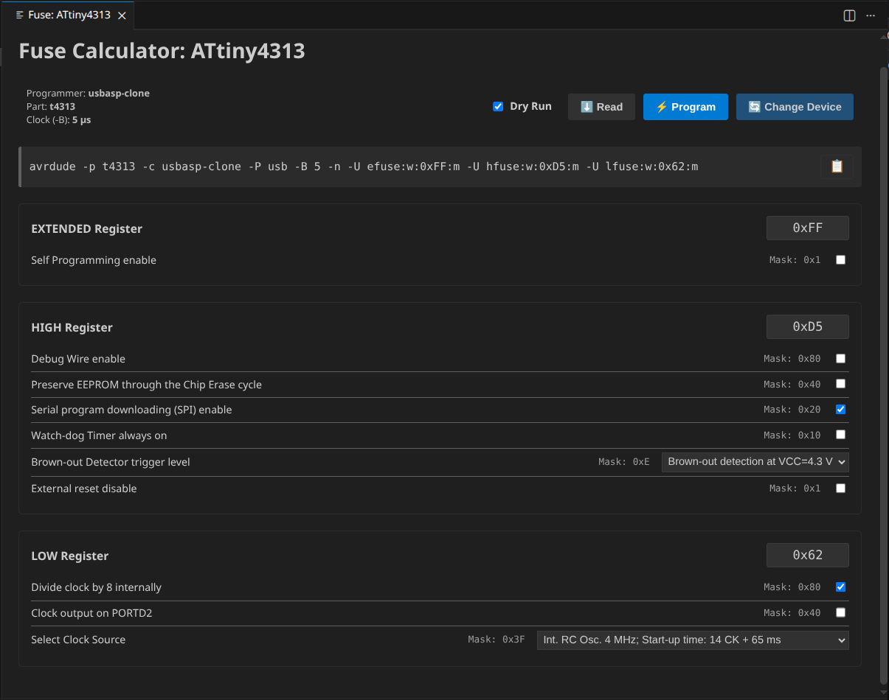
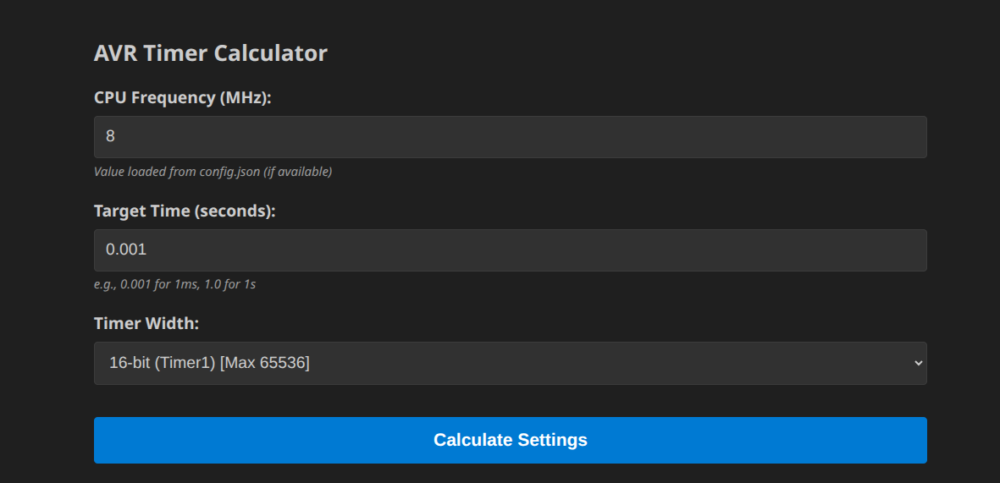
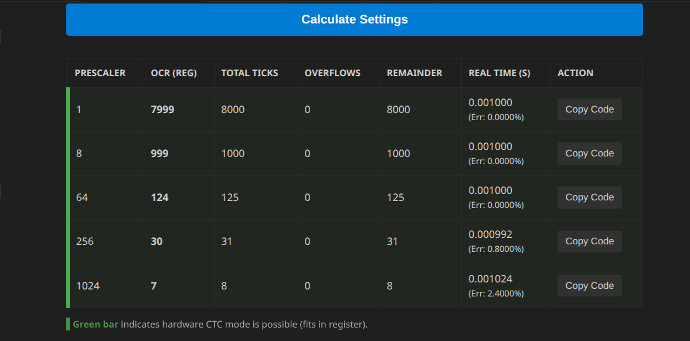
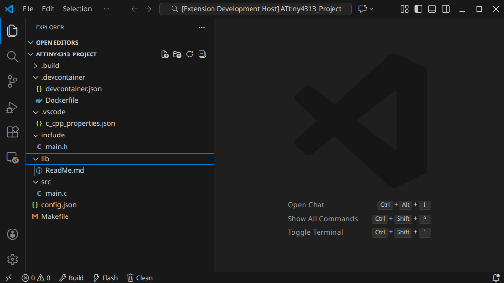

# Atmel C Project Generator

A VS Code extension to quickly and easily create, configure, and develop C/C++ projects for Atmel AVR microcontrollers (ATmega, ATtiny).

This extension relies on standard tools (`avr-gcc`, `make`, `avrdude`) and integrates them seamlessly into VS Code, including fully automatic IntelliSense configuration, Timer Calculator, and Fuse Bit calculation.

## Features

  * **Project Scaffolding:** Creates a clean and simple project structure (`src`, `include`, `lib`) with a wizard.
  * **Integrated Fuse Calculator:** Calculate Fuse Bits (Low, High, Extended) directly within VS Code, without needing to visit external websites.
  * **Integrated Timer Calculator:** Calculate register values and generate code examples.
  * **Reconfigure Function:** Change MCU, clock frequency, or programmer at any time – all files (Makefile, VS Code Config) are synchronized immediately.
  * **DevContainer Support:** Optional support for Docker-based development environments.
  * **Auto-IntelliSense:** Automatically configures `c_cpp_properties.json`. It detects the compiler's system include paths and sets the correct defines 

## Prerequisites

For this extension to work, the AVR tools must be installed on your system and available in your system `PATH`.

### Linux (Debian/Ubuntu/Mint)

```bash
sudo apt-get update
sudo apt-get install gcc-avr binutils-avr avr-libc avrdude make
```

### Windows

You need an AVR Toolchain and GNU Make. Recommended:

  * **Toolchain:** [Zak’s AVR-GCC builds](https://blog.zakkemble.net/avr-gcc-builds/) or WinAVR.
  * **Make:** GNU Make for Windows.
  * **Path:** Ensure that `avr-gcc.exe`, `make.exe`, and `avrdude.exe` are added to your Windows Environment Variables (`PATH`).

## Extension Settings

You can configure default values in the VS Code Settings (`Ctrl + ,` -\> Search for "Atmel"):

  * `atmelGenerator.defaultProjectPath`:
  * `atmelGenerator.defaultCompilerPath`: Path to the compiler (Default: `avr-gcc`).
  * `atmelGenerator.defaultAvrdudePath`: Path or command for avrdude.
  * `atmelGenerator.programmer`: Default programmer for avrdude (e.g., `stk500v2`, `usbasp`, `arduino`).
  * `atmelGenerator.port`: Default port (e.g., `/dev/ttyUSB0` or `COM3`).
  * `atmelGenerator.bitClock`: Default `-B` BitClock setting for avrdude (Default: `5`).
  * `atmelGenerator.enableDevContainer`: Enable DevContainer support when generating new projects.
  * `atmelGenerator.devContainerTemplatePath`: Optional: Path to a custom DevContainer template directory.
  * `atmelGenerator.defaultCPUFrequency`: Default clock frequency in Hz (Default: `1000000`).

## Usage

### 1\. Create a New Project

1.  Open the Command Palette (`Ctrl+Shift+P` / `F1`).
2.  Search for **"Atmel: Create Project"**.
3.  Select device, programmer, folder, and enter the project name.

### 2\. Configure Project (Reconfigure)

Need to change the clock speed or switch to a different chip?

1.  Open `config.json` in your project directory and adjust the values (or use the command).
2.  Run **"Atmel: Reconfigure Project"**.
3.  IntelliSense and the Makefile are updated immediately.

### 3\. Build, Flash, and Clean


You can use the buttons in the status bar or the following terminal commands:

 | Action | Command | Description |
 | :--- | :--- | :--- |
 | **Build** | `make` | Compiles the project. |
 | **Flash** | `make flash` | Flashes the firmware to the device. |
 | **Clean** | `make clean` | Removes build artifacts from `.build`. |


### 4\. Calculate Fuse Bits

No need to dig through datasheets for standard fuses:

1.  Open the Command Palette.
2.  Select **"Atmel: Open Fuse Calculator"**.



### 5\. Timer Calculator

Calculate register values for TCCxx, OCRxx, TIMSKx, and generate empty ISR-Routine.

1.  Open the Command Palette.
2.  Select **"Atmel: Open Timer Calculator"**.



Result




Generated Code

```c
/*
 * Timer 1 Configuration (CTC Mode)
 * Target: 125 ticks @ Prescaler 64
 * CAUTION: Register names (TCCR1A, etc.) follow ATmega328P standard.
 * Check your specific MCU datasheet if registers differ (e.g. ATtiny).
 */

// 1. Reset Control Registers
TCCR1A = 0;
TCCR1B = 0;

// 2. Set CTC Mode (Clear Timer on Compare Match)
TCCR1B |= (1 << WGM12);

// 3. Set Prescaler to 64
TCCR1B |= (1 << CS11) | (1 << CS10);

// 4. Set Compare Match Value
OCR1A = 124;

// 5. Enable Compare Match Interrupt
TIMSK1 |= (1 << OCIE1A);

// --- Interrupt Service Routine ---
ISR(TIMER1_COMPA_vect) {
    // TODO: Execute periodic code here
}
```

## Generated Project Structure

A generated project looks like this:




## The `config.json`

This file stores the state of your project.

```json
{
    "id": "atmel-project-config",
    "protected": false,
    "project": "ATtiny4313_Project",
    "mcu": "attiny4313",
    "cpu_freq": 1000000,
    "programmer": "usbasp-clone",
    "partno": "t4313",
    "port": "usb",
    "bitClock": 5,
    "io_def": "__AVR_ATtiny4313__"
}
```

## DevContainer Behavior

Controlled through VS Code settings:

### When DevContainer support is **enabled**:
- If a *custom* template path is provided → use that.  
- Otherwise → use the default `.devcontainer` template contained in the extension.

### When DevContainer support is **disabled**:
- Any `.devcontainer` folder contained in the template is removed.

This allows:

- pure native development,
- DevContainer-based development,
- or custom container environments.


## Troubleshooting

**Error: "avr-gcc: command not found"**
Ensure that the compiler is installed and the path is correctly set in the VS Code Settings or is available in your system `PATH`.

**Error: IntelliSense cannot find `<avr/io.h>`**
Run the command **"AVR: Reconfigure Project"**. This forces the extension to re-probe the compiler's system paths and write them to the configuration.

**Error while flashing (avrdude)**
Check `config.json` to ensure `programmer` and `port` are correct for your hardware setup.

## 📄 License

[MIT](https://www.google.com/search?q=LICENSE)
